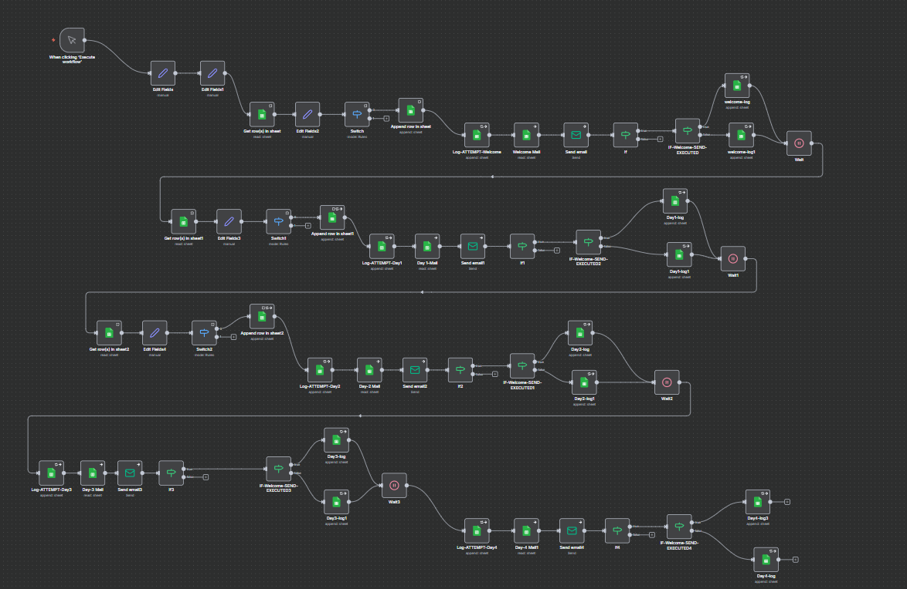
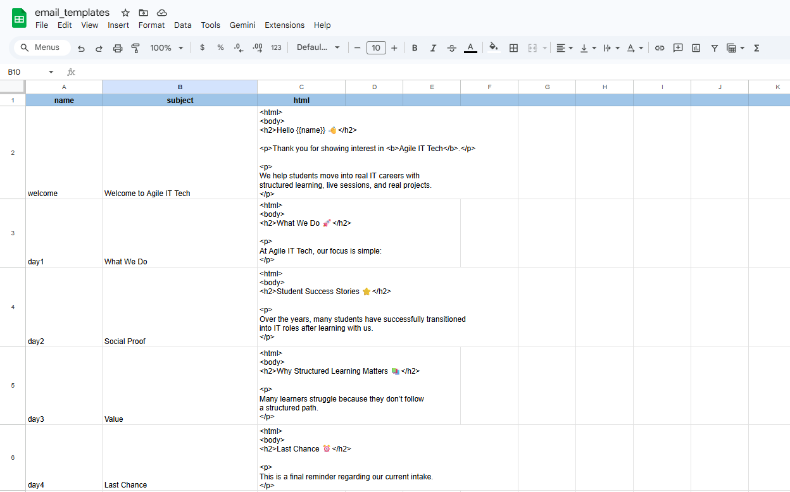
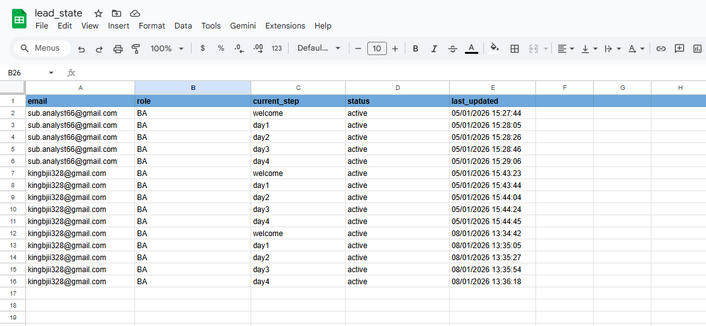
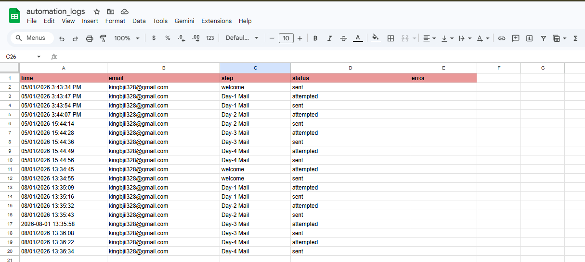

📧 n8n Email Automation Engine

A MailerLite-style email automation system built using n8n workflows and Google Sheets.

This project demonstrates how to create a multi-step email drip campaign system that automatically sends onboarding or marketing emails to leads while tracking progress and logging automation activity.

🚀 Features

✔ Multi-step email automation
✔ Email template management
✔ Lead state tracking
✔ Automation logging
✔ Delay scheduling between emails
✔ Google Sheets integration
✔ Workflow automation using n8n

🛠 Tech Stack
Technology	Purpose
n8n	Workflow automation engine
Google Sheets	Database for leads, templates, and logs
SMTP / Email Node	Sending automated emails
HTML Templates	Email content
🏗 System Architecture

The automation system consists of three major components.

Email Templates

Stores email subject and HTML body.

name	subject	html
welcome	Welcome to Agile IT Tech	HTML template
day1	What We Do	HTML template
day2	Social Proof	HTML template
day3	Value	HTML template
day4	Last Chance	HTML template

These templates are dynamically loaded by the workflow.

Lead State Tracking

Tracks subscriber progress in the automation sequence.

email	role	current_step	status	last_updated
user@email.com
	BA	day2	active	timestamp

The workflow reads the current_step to determine the next email to send.

Automation Logs

Logs all workflow activity.

time	email	step	status	error
timestamp	user@email.com
	welcome	sent	

Logs help monitor:

email delivery

workflow execution

automation failures

🔄 Workflow Logic

The automation workflow follows a drip campaign sequence.

Trigger
   ↓
Load Email Template
   ↓
Send Welcome Email
   ↓
Log Automation Event
   ↓
Wait (Delay)
   ↓
Send Day1 Email
   ↓
Wait
   ↓
Send Day2 Email
   ↓
Wait
   ↓
Send Day3 Email
   ↓
Wait
   ↓
Send Day4 Email

Each step updates the lead state sheet.

📷 Workflow Screenshots
## 📷 Screenshots

### 🔹 n8n Automation Workflow

---

### 🔹 Email Templates (Google Sheets)

---

### 🔹 Lead State Tracking

---

### 🔹 Automation Logs

📂 Project Structure
n8n-email-automation-engine
│
├── README.md
│
├── Workflow
│     ├── email_automation_workflow.json
│     └── images
│          ├── workflow-image.png
│          ├── email-template.png
│          ├── lead-state.png
│          └── automation-log.png
⚙ Setup Instructions
1️⃣ Install n8n

Using npm:

npm install n8n -g

Or using Docker:

docker run -it --rm -p 5678:5678 n8nio/n8n
2️⃣ Import Workflow

Open n8n dashboard

Click Import Workflow

Upload the workflow JSON file

3️⃣ Configure Credentials

Set up:

Google Sheets credentials

SMTP email credentials

4️⃣ Activate Workflow

Activate the workflow to start the automation system.

📊 Example Email Sequence
Step	Email
Step 1	Welcome Email
Step 2	What We Do
Step 3	Social Proof
Step 4	Value
Step 5	Last Chance
💡 Future Improvements

Possible enhancements:

email open tracking

click tracking

unsubscribe system

segmentation

analytics dashboard

📚 Learning Outcomes

This project demonstrates:

workflow automation design

marketing automation architecture

state management

automation logging

third-party integrations

👨‍💻 Author

Pa1KalyanY

GitHub
https://github.com/Pa1KalyanY
